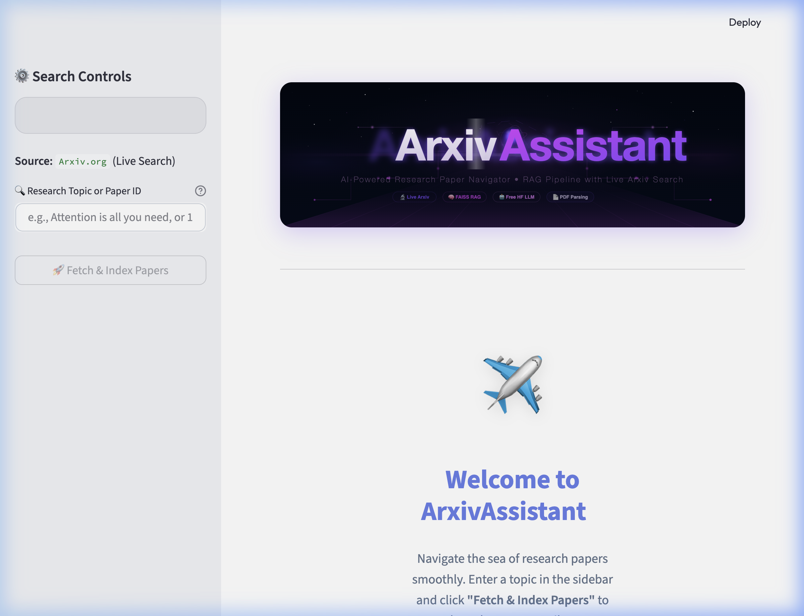
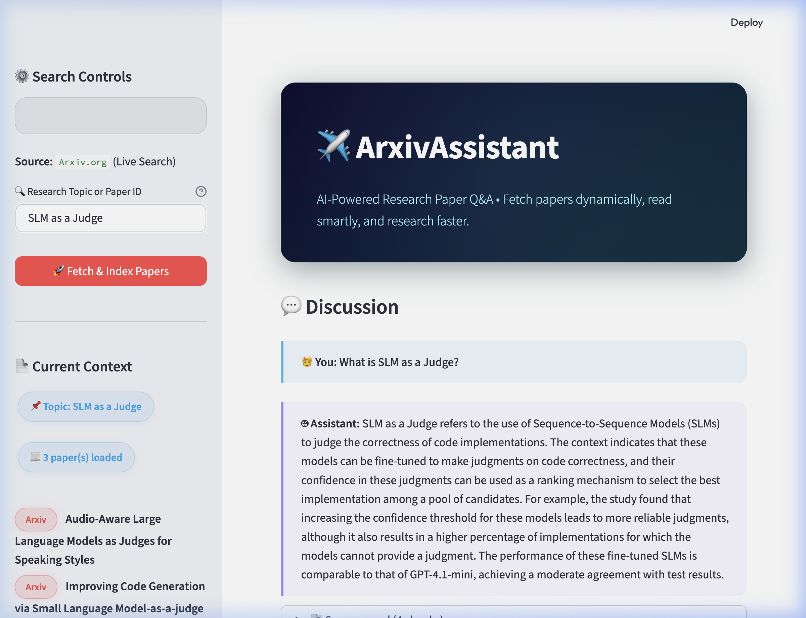

<p align="center">
  
</p>

# 🔬 ArxivAssistant

**By [Anish Laddha](https://github.com/anishh15)**

A **Retrieval-Augmented Generation (RAG)** research paper navigator that dynamically fetches papers from **Arxiv** and answers questions using a full LangChain RAG pipeline — built with **100% free components**. No pre-loaded PDFs — everything is fetched live.

## ✨ Features

- **Smart Two-Pass Search** — Title-specific search first (`ti:` prefix), then keyword fallback across all fields with deduplication
- **Arxiv ID Support** — Paste an ID like `1706.03762` to fetch a specific paper directly
- **Full PDF Text Extraction** — Downloads and parses PDFs via `pymupdf` for deep content; falls back to abstract if unavailable
- **FAISS Vector Search** — Chunks documents with `RecursiveCharacterTextSplitter`, embeds locally with `all-MiniLM-L6-v2`, and indexes in FAISS
- **Grounded Q&A** — Uses `Qwen2.5-7B-Instruct` via HuggingFace Inference API with source citations
- **Premium Animated UI** — Custom SVG banner, glassmorphic cards, chat history, expandable sources

## 🛠️ Architecture

```text
User Query → Arxiv API (two-pass: title → keyword)
           → PDF Download & Text Extraction (pymupdf)
           → RecursiveCharacterTextSplitter (1000 chars, 200 overlap)
           → HuggingFace Embeddings (all-MiniLM-L6-v2, local)
           → FAISS Vector Store (in-memory)
           → Retriever (top-4 similarity search)
           → Stuff Documents Chain + ChatHuggingFace (Qwen2.5-7B)
           → Answer with Source Citations
```

## 💻 Tech Stack

| Component | Technology | Cost |
|-----------|-----------|------|
| **LLM** | Qwen2.5-7B-Instruct (HuggingFace Inference API) | Free |
| **Embeddings** | sentence-transformers/all-MiniLM-L6-v2 (local) | Free |
| **Vector Store** | FAISS (in-memory) | Free |
| **Document Loader** | `arxiv` library (direct API) with PDF extraction | Free |
| **Text Splitter** | RecursiveCharacterTextSplitter | Free |
| **UI** | Streamlit with custom CSS + animated SVG banner | Free |

## 📁 Project Structure

```
ArxivAssistant/
├── app.py              # Streamlit UI (380 lines - custom CSS, sidebar, chat)
├── rag_chain.py        # Core RAG pipeline (LLM → embeddings → FAISS → chain)
├── loaders.py          # Arxiv search with two-pass strategy + PDF extraction
├── config.py           # Centralized configuration for all parameters
├── requirements.txt    # Python dependencies
├── .env.example        # Template for HuggingFace API token
├── .env                # Your actual token (gitignored)
├── assets/
│   ├── banner.svg      # Animated space-themed SVG banner
│   └── logo.svg        # Circular logo with magnifying glass icon
└── README.md
```

## 🚀 Setup & Installation

1. **Navigate to the project directory:**
   ```bash
   cd ArxivAssistant
   ```

2. **Create a virtual environment:**
   ```bash
   python -m venv venv
   source venv/bin/activate  # macOS/Linux
   ```

3. **Install dependencies:**
   ```bash
   pip install -r requirements.txt
   ```

4. **Set up your HuggingFace token:**
   ```bash
   cp .env.example .env
   ```
   Open `.env` and paste your free HuggingFace API token from [huggingface.co/settings/tokens](https://huggingface.co/settings/tokens)

5. **Run the application:**
   ```bash
   streamlit run app.py
   ```

## 📸 Screenshots

<p align="center">
  
  <br><em>Landing page with animated SVG banner and welcome section</em>
</p>

<p align="center">
  
  <br><em>RAG Q&A with source citations and chat history</em>
</p>

## 🎯 Usage

1. Open the app at `http://localhost:8501`
2. Enter a paper title like `"Attention is all you need"` or a topic like `"SLM as a Judge"`
3. Or paste an Arxiv ID like `1706.03762` for exact paper fetch
4. Click **"Fetch & Index Papers"** — papers are fetched, PDFs parsed, and content indexed
5. Ask questions — e.g., *"What is self-attention and how does it work?"*
6. Expand **"📑 Sources used"** to see the exact chunks the AI referenced

## 📚 LangChain Concepts Demonstrated

- **Direct `arxiv` API** — Bypassed `ArxivLoader` for proper field-based search (`ti:` title prefix, `all:` keyword search)
- **`RecursiveCharacterTextSplitter`** — Token-aware chunking with configurable size and overlap
- **`HuggingFaceEmbeddings` + `FAISS`** — Local embedding generation + fast similarity search
- **`ChatHuggingFace` + `HuggingFaceEndpoint`** — Free LLM inference via HF API
- **`create_stuff_documents_chain` + `create_retrieval_chain`** — Modern LCEL RAG pipeline
- **`ChatPromptTemplate`** — System + human message prompt with grounding instructions
